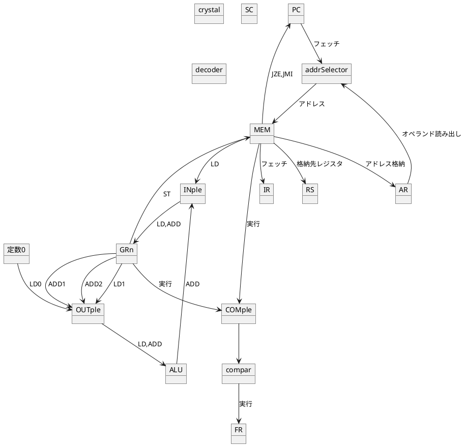
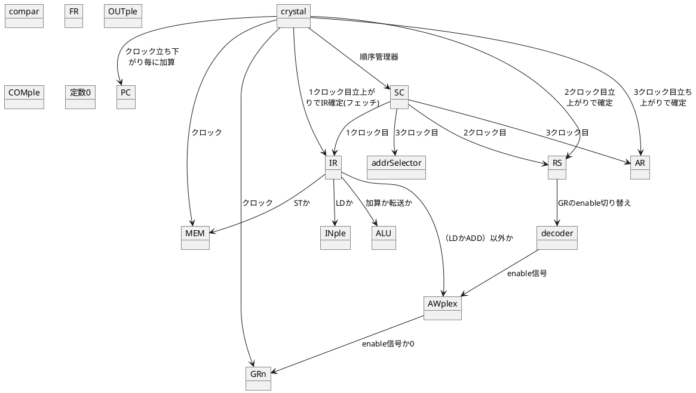

フェッチ→デコード→オペランド読み出し→実行
#### フェッチ
メモリから読み出す。
プログラムカウンタに示されている番地から命令レジスタへ転送する。
#### デコード
プログラムカウンタからデコーダへ送り出す。
各制御装置へ信号を送り出す。
#### オペランド読み出し
処理に必要なデータをメモリから取り出して
#### 実行
レジスタやメモリ、PCなどの記憶装置に対して書き込む
#### CPUでは実装しない部分
コンパイラによるインライン展開
### 目標
四則演算ができる電卓を作る！
繰り返し計算ができる！（平均を求められる）

#### 実装する命令
3語長
##### 転送系
- レジスタ <--> メモリ
    - LD
    - ST
- レジスタ <--> レジスタ
    - LD
##### 制御系
- ゼロ分岐
    - JZE
- 負分岐
    - JMI
- 待ち
    - NOP
##### 演算系
- 算術加算
    - ADD
- 減算は負数の加算で実現する。
#### メモリ管理
- 定数定義
    - DC
- 領域確保
    - DS

#### 三語で一命令
1語目は命令
2は宛先レジスタ
3はレジスタかメモリ番地
数値の範囲は-8~7

#### 命令一覧
|文字列|意味|
|:-:|:-:|
|n|任意の数字|
|addr|メモリのアドレスかラベル|
|size|領域サイズを表す。単位はワード|

|命令|動作|構文|
|:-:|:-:|:-:|
|LD|(メモリ)->レジスタ|LD GRn addr|
|LD|レジスタ->レジスタ|LD GRn GRn|
|ST|レジスタ->(メモリ)|ST GRn addr|
|JZE|ゼロフラグが1の時ジャンプ先にジャンプする|JZE addr|
|JMI|ゼロフラグとサインフラグが1の時ジャンプ先にジャンプする|JMI addr|
|NOP|何もしない命令|NOP|
|ADD|算術加算を行う|ADD GRn GRn|
|DC|定数を定義する|DC n|
|DS|領域を確保する|DS size|

#### データフロー

#### 制御フロー
