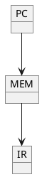

フェッチ→デコード→実行
#### フェッチ
メモリから読み出す。
プログラムカウンタに示されている番地から命令レジスタへ転送する。
#### デコード
プログラムカウンタからデコーダへ送り出す。
各制御装置へ信号を送り出す。
#### オペランド読み出し
処理に必要なデータをメモリから取り出して
#### CPUでは実装しない部分
コンパイラによるインライン展開
### 目標
クイックソートができる
関数呼び出し、構造化できる。
スタック領域と制御。